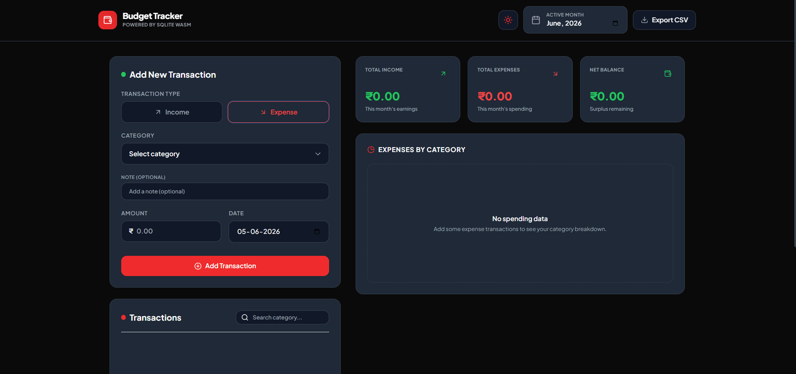
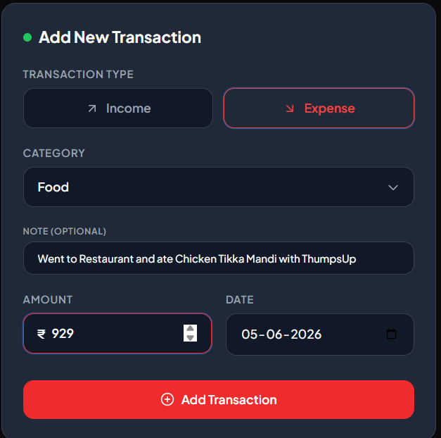
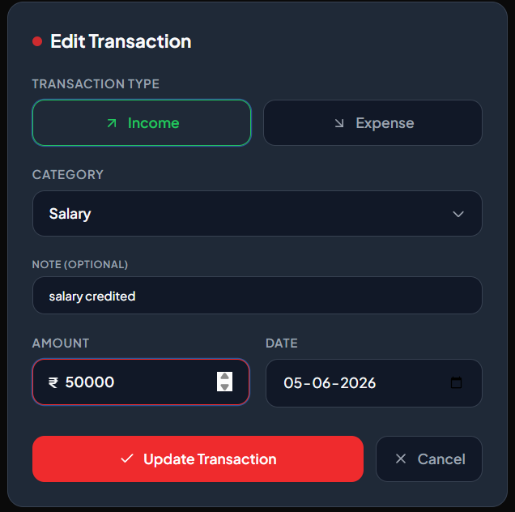
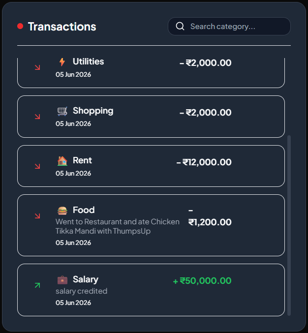
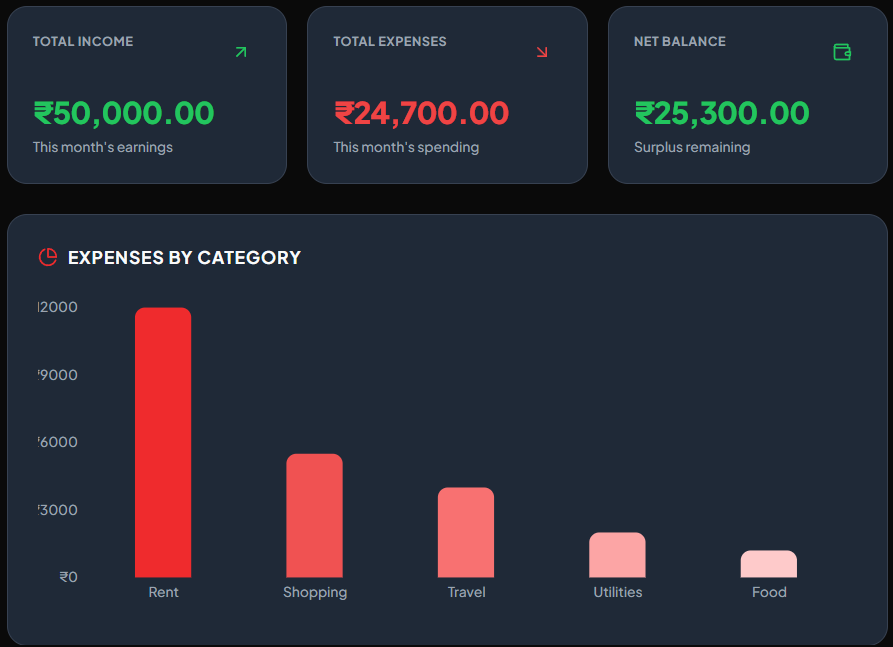
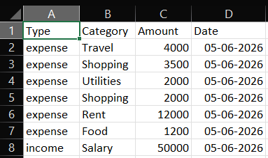

# Personal Budget Tracker – azentrix-fullstack-task1

_A minimalist, premium, fully client-side budget tracker built with React, SQLite (WebAssembly), and localStorage – no backend required._

---

## 🚀 Demo Video

📹 [Watch the full walkthrough on Loom](https://www.loom.com/share/8f0f377b54b4488ab3a01934abf722f6)

---

## 🔗 Application Link

[Personal Budget Tracker](https://budget-tracker-pi-five.vercel.app/)

---

## ✨ Features

- ✅ **CRUD Operations** – Add, edit, and delete income or expense transactions.
- ✅ **Monthly Summary Dashboard** – Total income, total expenses, net balance, and a dynamic **Recharts bar chart** showing expenses by category for the selected month.
- ✅ **SQLite in the Browser** – Full relational database with CHECK constraints, indexes, and aggregate queries – all running locally via WebAssembly (`sql.js`).
- ✅ **localStorage Persistence** – Automatically saves and restores the database across sessions using Base64 serialization.
- ✅ **Responsive Design** – Soft minimal UI with warm neutral tones, custom Tailwind theme, and fully adaptive layout (mobile to desktop).
- ✅ **Input Validation** – No negative amounts, valid date required, type must be income/expense – validated on both client and database level.
- ✅ **Edit & Delete with Confirmation** – Each transaction can be edited inline, and deletion triggers a confirmation dialog to prevent mistakes.
- ✅ **Month Picker** – Filter all views and chart by a specific month/year.
- ✅ **Optional Description/Notes** – Add a short note to any transaction for extra context.
- ✅ **CSV Export** – Export current month’s transactions to a CSV file (completely offline).
- ✅ **Lovely Details** – Category emojis, toast notifications, smooth animations, and professional empty states.

---

## 🧰 Tech Stack

| Layer         | Technology                                    |
| ------------- | --------------------------------------------- |
| Frontend      | React 18 (Vite), Tailwind CSS v3              |
| Charts        | Recharts                                      |
| Database      | SQLite (compiled to WebAssembly via `sql.js`) |
| Persistence   | Browser `localStorage` (Base64-encoded DB)    |
| Notifications | react-hot-toast                               |
| Icons         | lucide-react                                  |
| Date Handling | date-fns                                      |

---

## 📸 Screenshots & Demos

Below are placeholders where you can add your custom screenshots of the application.

### 1. Dashboard Overview

<!-- Place your dashboard overview screenshot at: ./screenshots/dashboard_overview.png -->


_Figure 1: Dashboard overview displaying responsive Total Income, Total Expenses, and Net Balance summary cards alongside the Recharts category expense distribution bar chart._

### 2. Adding Transaction Form

<!-- Place your transaction form screenshot at: ./screenshots/transaction_form.png -->


_Figure 2: Transaction addition form, showcasing the minimalist responsive category dropdown, type toggle badges, and the secondary optional note field._

### 3. Editing Transaction Form


_Figure 3: Transaction editing form, showcasing the minimalist responsive category dropdown, type toggle badges, and the secondary optional note field._

### 4. Transaction Ledger with Search and Emojis


_Figure 4: Transaction list displaying dynamic category emojis, customized transaction note cards, date highlights, and action controls with confirmation dialog triggers._

### 5. Analytics Chart


_Figure 5: Analytics chart displaying category-wise expense distribution using Recharts bar chart for the selected month._

### 6. Exported CSV


_Figure 6: Exported CSV file showing the list of transactions for the selected month._

---

## 🧠 Architectural Approach

This application utilizes a **100% frontend-only relational database architecture**. It replicates full-stack database parity entirely inside the client sandbox using the following concepts:

### 1. WebAssembly SQLite Engine (`sql.js`)

Rather than relying on a traditional REST API backed by an Express/Node server, the application initializes a real, in-memory SQLite database compiler using **WebAssembly** on launch. This allows you to write structured, query-driven database logic—including indexes, CHECK constraints, aggregates (`SUM`), and category grouping (`GROUP BY`)—directly in client code.

### 2. LocalStorage Persistence Layer

To persist transactions across user sessions:

- On startup, the system reads a Base64-serialized database representation from the browser's `localStorage`.
- It decodes the Base64 data back into a raw byte buffer (`Uint8Array`) and boots the SQLite compiler with it.
- After every write operation (Insert, Update, Delete), the updated SQLite database exports itself to a binary buffer, converts to Base64, and updates `localStorage`.

---

## 🛠️ Database Schema

The database is initialized in-browser with the following schema:

```sql
CREATE TABLE IF NOT EXISTS transactions (
  id INTEGER PRIMARY KEY AUTOINCREMENT,
  type TEXT NOT NULL CHECK(type IN ('income', 'expense')),
  category TEXT NOT NULL,
  amount REAL NOT NULL CHECK(amount > 0),
  date TEXT NOT NULL,          -- Format: YYYY-MM-DD
  description TEXT DEFAULT '', -- Optional notes
  created_at DATETIME DEFAULT CURRENT_TIMESTAMP
);

CREATE INDEX IF NOT EXISTS idx_transactions_date ON transactions(date);
```

---

## ⚙️ Setup & Installation Instructions

### Prerequisites

Make sure you have [Node.js](https://nodejs.org/) installed (version 18+ is recommended).

### 1. Clone & Install

Open your terminal in the project directory and run:

```bash
git clone https://github.com/bhargav2006/azentrix-fullstack-task1.git
cd azentrix-fullstack-task1
npm install
```

(Or `pnpm install`)

### 2. Start Development Server

Start the local Vite development server:

```bash
npm run dev
```

(Or `pnpm run dev`)
Navigate to `http://localhost:5173` in your browser. The SQLite WebAssembly engine will initialize and serve the app locally.

### 3. Build for Production

To bundle and optimize the application for production deployment:

```bash
npm run build
```

(Or `pnpm run build`)
The compiled static assets (HTML, CSS, JS, and WASM copies) will be outputted to the `dist/` directory.

---
